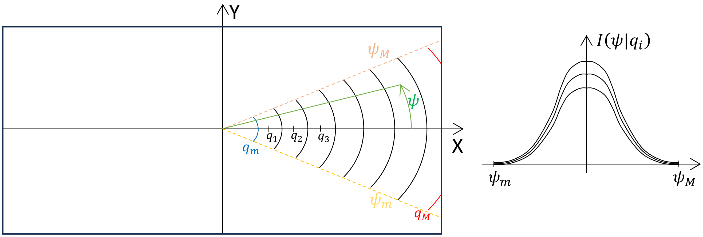
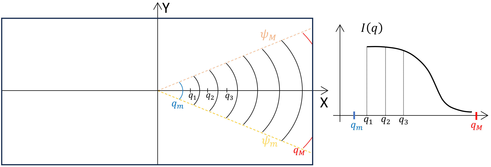
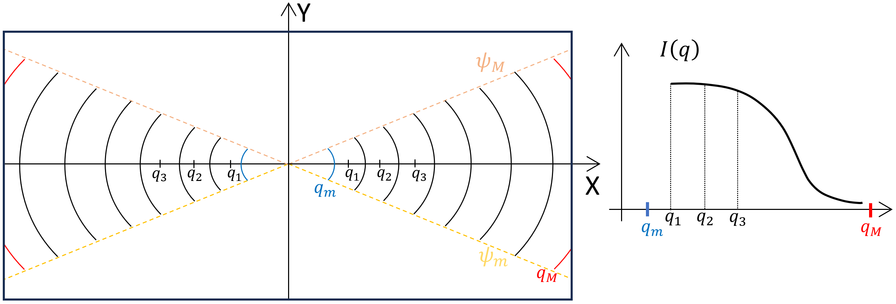
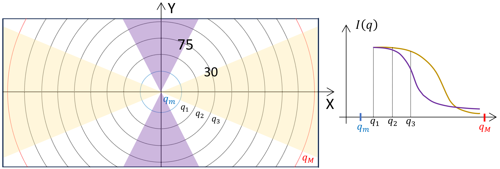
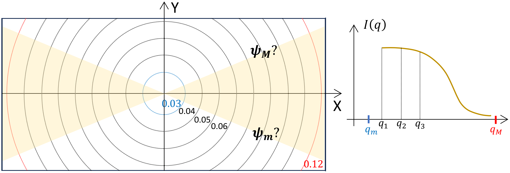
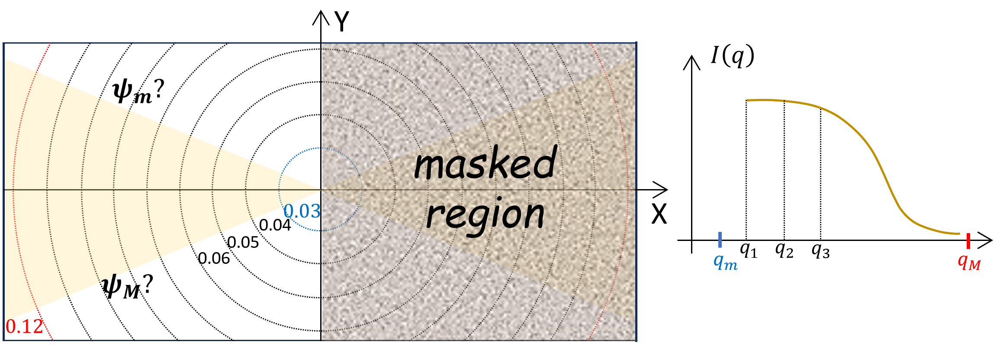
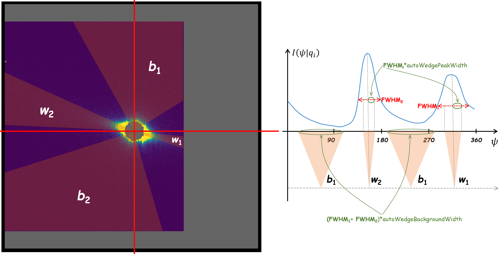

.. _user.binning:

Binning
=======

Scalar Binning
--------------

Scalar or azimuthal binning produces a one dimensional intensity profile :math:`I(Q)` from
:math:`I(x,y,\lambda)`.

.. code-block:: json

    {
      "1DQbinType": "scalar",
      "QbinType": "linear",
      "numQBins": 200,
      "Qmin": 0.003,
      "Qmax": 0.005,
    }

Wedge Binning
-------------

In Small-Angle Neutron Scattering (SANS), wedge binning is a data analysis technique used to enhance
the signal-to-noise ratio by collecting data over specific angular sectors, or "wedges," of the detector.
This method is particularly useful when the scattering pattern exhibits anisotropy due to preferred
directions in the sample structure.

After obtaining intensity :math:`I(q_x, q_y)` in the detector plane, we can rebin the intensity in
"polar" coordinates :math:`I(q, \psi)`, where :math:`q = \sqrt{q_x^2 + q_y^2}` is the magnitude of the
scattering vector and :math:`\psi = \arctan(q_y/q_x)` is the azimuthal angle. The intensity is then
binned into :math:`q`-bins of constant width.

Most typical is to integrate :math:`I(q, \psi)` over the azimuthal angle :math:`\psi` between
limits :math:`\psi_m` and :math:`\psi_M` defining a wedge, yielding the :math:`I(q)`
representative of the feature captured in the wedge region.

The feature is achiral so the intensity profile is symmetric in the :math:`X`-axis,
:math:`I(-q_x, q_y) = I(q_x, q_y)` or :math:`I(q, \pi - \psi) = I(q, \psi)`.
The intensity profile is then binned within the region defined by the two symmetric wedges:

`drtsans` provides a function to perform wedge binning on the detector plane. User can specify the
the azimuthal limits for one or more wedges. For instance, the two wedges
:math:`(-30, 30)` and :math:`(75, 105)` can be specified as:

.. code-block:: json

    {
      "WedgeMinAngles": [-30, 75],
      "WedgeMaxAngles": [ 30, 105]
    }

`drtsans` **assumes achiral features** so the wedges symmetric to these two wedges are included in the binning.

Automatic Finding of the Wedge
+++++++++++++++++++++++++++++++

If User wants `drtsans` to automatically find the azimuthal limits for wedge binning, there are
options to specify. For instance, we want the resulting :math:`I(q)` from :math:`q_{min}=0.03 A^{-1}`
to :math:`q_{max}=0.12 A^{-1}` in bins of width :math:`\delta q=0.01 A^{-1}`.
The automatic finding is restricted to one wedge along the :math:`X`-axis,
along with its symmetric counterpart. `drtsans` will find the azimuthal limits for the wedge.

.. code-block:: json

    {
      "autoWedgeQmin": 0.03,
      "autoWedgeQmax": 0.12,
      "autoWedgeQdelta": 0.01,
    }

User may define a single azimuthal range for the automatic finding of the wedge.
User can provide negative values for the azimuthal range, for instance, :math:`(-90, -30)`, with the understanding
that the range is interpreted as :math:`(270, 330)`.
Once the `autoWedgePhiMin` and `autoWedgePhiMax` range is provided,
the search for the wedge begins at the midpoint of the range, and is initially constrained to half the range
around this midpoint.

For instance, in the BIOSANS instrument the area in the main detector defined by the azimuthal range
:math:`(-90, 90)` is partially occluded by the Wing detector,
because the Wing detector is positioned closer to the sample than the main detector.
User can request finding the wedge in the azimuthal range :math:`(90, 270)` free from occlusion, and then
automatically include the symmetric wedge in the binning.
The range :math:`(-90, 90)` is effectively masked during the wedge search.

.. code-block:: json

    {
      "autoWedgeQmin": 0.03,
      "autoWedgeQmax": 0.12,
      "autoWedgeQdelta": 0.01,
      "autoWedgePhiMin": 90,
      "autoWedgePhiMax": 270,
      "autoSymmetricWedges": true
    }

Other additional options for the automatic wedge finding:

- `autoWedgeAzimuthalDelta`: binning in azimuthal angle when generating the :math:`I(\phi)` profile.
- `autoWedgePeakWidth`: percent of the full-width-half-max (FWHM) of the peak in the :math:`I(\phi)` profile
  representing a wedge, used to define the confidence limits of the wedge.
- `autoWedgeBackgroundWidth`: percent of the full-width-half-max (FWHM) of the peak in the :math:`I(\phi)` profile
  representing a wedge, used to define the confidence limits of the background signal for the wedge.

For instance, for real data collected at the BIOSANS instrument,

.. code-block:: json

    {
      "autoWedgeQmin": 0.0,
      "autoWedgeQmax": 0.02,
      "autoWedgeQdelta": 0.001,
      "autoWedgeAzimuthalDelta": 1.0,
      "autoWedgePeakWidth": 0.25,
      "autoWedgeBackgroundWidth": 1.5
    }

We obtain two wedges (:math:`w_1`, :math:`w_2`) as well as two azimuthal ranges (:math:`b_1`, :math:`b_2`)
interpreted as background signal for the wedges.

Annular Binning
---------------

Annular binning produces a one dimensional intensity profile, :math:`I(\phi)`, which gives intensity
as a function of the angle around the beam center, :math:`\phi`, over a limited range of scalar
:math:`Q`. Annular binning uses linear spacing in :math:`\phi` with a default bin size of 1 degree.

.. code-block:: json

    {
      "1DQbinType": "annular",
      "AnnularAngleBin": 1.0,
      "Qmin": 0.003,
      "Qmax": 0.005,
    }
