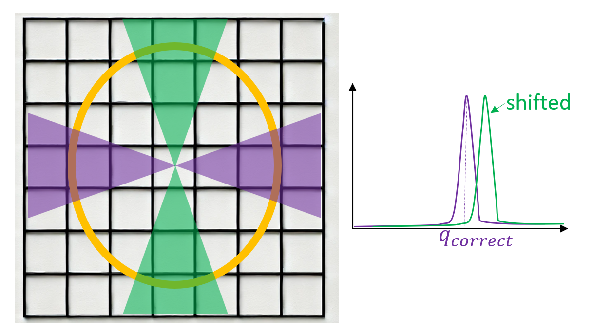
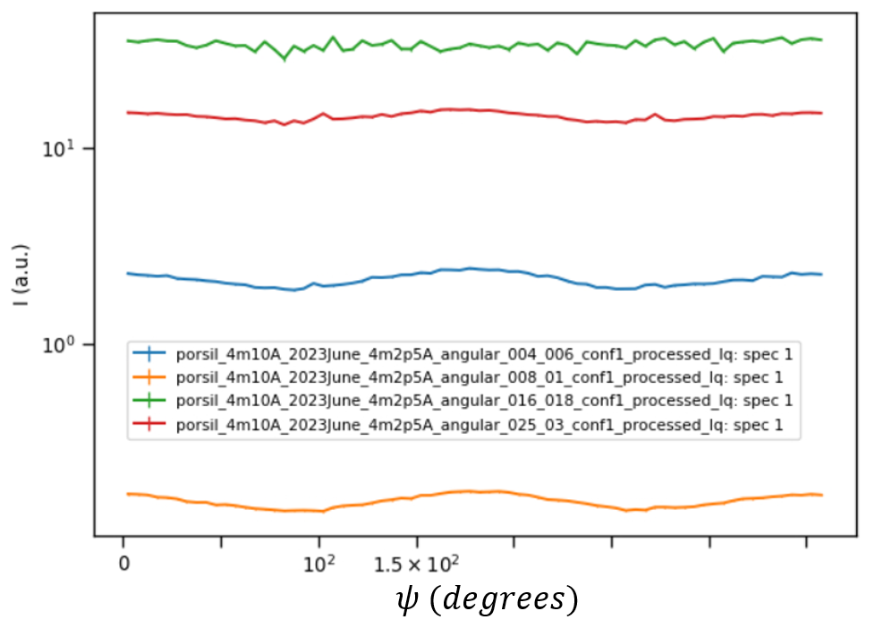

.. _calibration:

Calibration of the instrument
=============================

The calibration of the instrument is a critical pre-step in the reduction of the data.

Detector Panel Scaling
----------------------

Consider a powder sample that scatters strongly with a well resolved peak.
The intensity pattern produced by this sample on an ideal detector panel composed of a 7x7 array of
square pixels is shown in the Figure above (panel-a) as a sharp yellow intensity ring.
In this particular example, the ring is circumscribed by a 5x5 array of pixels.
If we were to perform an annular binning for the intensity collected between the two purple circles
corresponding to constant values of :math:`q` (:math:`q_{min}` and :math:`q_{max}`),
the resulting profile will be constant for all :math:`\psi` angles.

If the detector array is uncalibrated in such a way that the effective vertical pixel size is
somewhat smaller than the horizontal pixel size, the intensity ring will "spill over" the upper and lower
rows of pixels, as shown in panel-b. The ring radius hasn't changed because the scattering angle is the same,
being a property solely of the sample and the wavelength of the neutron beam.

We don't know that the detector is uncalibrated, so we assume that the vertical and horizontal pixel sizes are equal.
With this assumption, we create an ideal 7x7 detector panel and imprint on it the intensity pattern that was
collected with the uncalibrated detector. The result is shown in panel-c.
The intensity ring is now distorted into an ellipse. This uncalibrated data will be subsequently reduced,
leading to incorrect results.

In the next figure, we did an annular binning for the intensity collected between :math:`q_{min}` and :math:`q_{max}`
yielding a profile that is not constant, but is maximum at :math:`\psi = 0` and :math:`\psi = \pi`,
and decreases to zero for :math:`\psi = \frac{\pi}{2}` and :math:`\psi = \frac{3\pi}{2}`.
Conversely, a profile that is maximum at :math:`\psi = \frac{\pi}{2}` and zero at :math:`\psi = 0` would
indicate an uncalibrated detector with a vertical pixel size that is larger than the horizontal pixel size.

In the next figure, we did a binning in Q for two wedge regions (shown as purple and green), then plotted the
corresponding intensity profiles to show that the diffraction peak occurs at different Q values.
A contraction in the vertical pixel size leads to the peak shifting to a Q value higher than the correct one.

Below are examples of the effect using real data from EQSANS. The figure below shows the variation in
intensity as a function of the azimuthal angle :math:`\psi` for different annular binnings of SiBe data.
For instance, the orange curve corresponds to the annular binning between :math:`q_{min}=0.08 \AA^{-1}`
and :math:`q_{max}=0.01 \AA^{-1}`.

The figure below shows peak splitting for AgBe data when binned into two different wedges.
AgBe has a well defined diffraction peak so both peaks should overlap.

Insert a request to scale one (or more) components of the instrument in the reduction options.
For instance, to rescale components `detector1` and `wing_detector` of the BIOSANS instrument:

.. code-block:: json

    {
      "scaleComponents":
        {
          "detector1": [1.0, 1.1, 1.0],
          "wing_detector": [0.95, 1.0, 0.95]
        },
    }

See the `default parameter values page <https://drtsans.readthedocs.io/en/latest/drtsans/reduction_parameters.html>`_.
