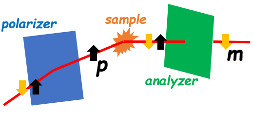

.. _polarization:

Polarization
============

.. note::
   This section covers functionality that is still under development.

Polarized neutron beam experiments employ either half polarization, where the incident beam is
polarized and the scattered beam is not analyzed, or full polarization, where the incident beam is
polarized and the polarization of the scattered beam is also analyzed.
The use of half or full polarization in a SANS experiment requires
parsing the data into states corresponding to the states of the flipper, and the analyzer that is
located between the sample and the detector.

.. contents:: Contents
   :local:

Beam polarization and polarization ratio
----------------------------------------

The wavelength-dependent polarization of the incident beam that is defined by the polarizer is
denoted :math:`P(\lambda)`. In the following, it is assumed that the polarizer produces the
spin-up state, which would be true for a reflection polarizer. If a transmission polarizer, which
produces the spin-down state, is employed, then the states derived from the measured flipper and
analyzer conditions, described below, are reversed.

:math:`P(\lambda)` is related to the instantaneous populations of spin-up and spin-down neutrons in
the beam, denoted :math:`N^{\uparrow}(\lambda)` and :math:`N^{\downarrow}(\lambda)`, respectively,
through Equation :eq:`eq-polarization`.

.. math::
    P(\lambda) = \frac{N^{\uparrow}(\lambda)-N^{\downarrow}(\lambda)}{N^{\uparrow}(\lambda)+N^{\downarrow}(\lambda)}
    :label: eq-polarization

The wavelength-dependent polarization ratio :math:`R(\lambda)`, often called the flipping ratio, is
defined by Equation :eq:`eq-flipping-ratio1`.

.. math::
    R(\lambda) = \frac{N^{\uparrow}(\lambda)}{N^{\downarrow}(\lambda)}
    :label: eq-flipping-ratio1

Then, :math:`R(\lambda)` can be expressed in terms of :math:`P(\lambda)` by Equation
:eq:`eq-flipping-ratio2`.

.. math::
    R(\lambda) = \frac{1 + P(\lambda)}{1 - P(\lambda)}
    :label: eq-flipping-ratio2

Data splitting by polarizer and analyzer states
-----------------------------------------------

During data reduction, the event stream of data is parsed into workspaces representing the states of
the polarizer and analyzer. Here, the notation used in the rest of this section is simplified by
abbreviating any polarizer or analyzer state SANS data :math:`S(x,y,\lambda)` as :math:`S(\lambda)`.
When half polarization is employed, the "off" and "on" states of the flipper are
measured , and the data are denoted :math:`S^0(\lambda)` and :math:`S^1(\lambda)`, respectively.
The quantities of interest in a half polarization measurement are the spin-up and spin-down state
SANS data sets, denoted :math:`S^{\uparrow}(\lambda)` and :math:`S^{\downarrow}(\lambda)`,
respectively, which are related to the measured states.

Using full polarization introduces two additional conditions for when the analyzer is set to either
:math:`0^{\circ}` or :math:`180^{\circ}`. As a result, four SANS data sets are measured, which are
denoted :math:`S^{00}(\lambda)`, :math:`S^{0\pi}(\lambda)`, :math:`S^{10}(\lambda)` and
:math:`S^{1\pi}(\lambda)`. By analogy with half polarization, there are four spin state SANS data
sets of interest in a full polarization experiment, namely :math:`S^{\uparrow\uparrow}(\lambda)`,
:math:`S^{\uparrow\downarrow}(\lambda)`, :math:`S^{\downarrow\uparrow}(\lambda)` and
:math:`S^{\downarrow\downarrow}(\lambda)`, that are related to the four measured polarization
states.

Half polarization - polarized beam without polarization analysis
----------------------------------------------------------------

Half polarization experiments use a spin flipper with a wavelength-dependent efficiency
:math:`e(\lambda)` between the polarizer and the sample to rotate the spins from up to down, or vice
versa depending on the polarizer in use. Consider the case that the flipper is off. The fractions of
the beam that are spin-up and spin down, denoted :math:`f_{up}` and :math:`f_{down}`, respectively,
are given by Equations :eq:`spin-up-fraction` and :eq:`spin-down-fraction`, respectively, and
sample the spin-up scattering :math:`S^{\uparrow}(\lambda)` and spin-down scattering
:math:`S^{\downarrow}(\lambda)`.

.. math::
    f_{up} = \frac{N^{\uparrow}}{N^{\uparrow}+N^{\downarrow}} = \frac{R(\lambda)}{1+R(\lambda)}
    :label: spin-up-fraction

.. math::
    f_{down} = \frac{N^{\downarrow}}{N^{\uparrow}+N^{\downarrow}} = \frac{1}{1+R(\lambda)}
    :label: spin-down-fraction

Then, the total scattering measured by the detector for the off state is given by Equation
:eq:`half-s-off`, and its uncertainty is given by Equation
:eq:`half-s-off-uncertainty`.

.. math::
    S^0(\lambda) = \frac{R(\lambda)}{1+R(\lambda)} S^{\uparrow}(\lambda) +
    \frac{1}{1+R(\lambda)} S^{\downarrow}(\lambda)
    :label: half-s-off

.. math::
    (\delta S^0(\lambda))^2 = \left(\frac{R(\lambda)}{1+R(\lambda)}\right)^2 \left(\delta
    S^{\uparrow}(\lambda)\right)^2 + \left(\frac{1}{1+R(\lambda)}\right)^2 \left(\delta
    S^{\downarrow}(\lambda)\right)^2
    :label: half-s-off-uncertainty

When the flipper is on, it rotates the spins in the beam produced by the polarizer by :math:`\pi`
with an efficiency :math:`e(\lambda)`. The flipped spins are sensitive to the spin-down scattering
state. The total scattering measured when the flipper is on, and its uncertainty are given by
Equations :eq:`half-s-on` and :eq:`half-s-on-uncertainty`, respectively.

.. math::
    S^1(\lambda) = \left[ e(\lambda) \frac{1}{1+R(\lambda)} + (1-e(\lambda))
    \frac{R(\lambda)}{1+R(\lambda)} \right] S^{\uparrow}(\lambda) + \\
    \left[ e(\lambda)
    \frac{R(\lambda)}{1+R(\lambda)} + (1-e(\lambda)) \frac{1}{1+R(\lambda)} \right]
    S^{\downarrow}(\lambda)
    :label: half-s-on

.. math::
    (\delta S^1(\lambda))^2 = \left[ e(\lambda) \frac{1}{1+R(\lambda)} + (1-e(\lambda))
    \frac{R(\lambda)}{1+R(\lambda)} \right]^2 \left(\delta S^{\uparrow}(\lambda)\right)^2 + \\
    \left[ e(\lambda) \frac{R(\lambda)}{1+R(\lambda)} + (1-e(\lambda)) \frac{1}{1+R(\lambda)}
    \right]^2 \left(\delta S^{\downarrow}(\lambda)\right)^2
    :label: half-s-on-uncertainty

As can be seen in Equations :eq:`half-s-off` through :eq:`half-s-on-uncertainty`, the measurements
produce data that contain mixtures of
both states. The spin-up and spin-down SANS data, along with the associated uncertainties, are
obtained by performing two :math:`2 \times 2` matrix inversions. The matrices are the coefficients
in Equations :eq:`half-s-off` and :eq:`half-s-on`, which is denoted
:math:`M_1`, and the coefficients in Equations :eq:`half-s-on-uncertainty` and
:eq:`half-s-on-uncertainty`, which is denoted :math:`M_2`. The matrix equations are
shown in Equations :eq:`m1-matrix` and :eq:`m2-matrix` and are functions of wavelength. These
equations no longer abbreviate the x and y dimensions of the SANS data.

.. math::
    \begin{pmatrix} S^{\uparrow}(x, y, \lambda) \\ S^{\downarrow}(x, y, \lambda) \end{pmatrix} =
    M_1^{-1} \begin{pmatrix} S^0(x, y, \lambda) \\ S^1(x, y, \lambda) \end{pmatrix}
    :label: m1-matrix

.. math::
    \begin{pmatrix} \delta S^{\uparrow}(x, y, \lambda)^2 \\ \delta S^{\downarrow}(x, y, \lambda)^2 \end{pmatrix} =
    M_1^{-1} \begin{pmatrix} \delta S^0(x, y, \lambda)^2 \\ \delta S^1(x, y, \lambda)^2 \end{pmatrix}
    :label: m2-matrix

Solving for :math:`S^{\uparrow}(x, y, \lambda)`, :math:`S^{\downarrow}(x, y, \lambda)` yields the
following equations.

.. math::
    S^{\uparrow}(x, y, \lambda) = S^0(x, y, \lambda) + \frac{1}{e(\lambda)[R(\lambda)-1]}
    \left[ S^0(x, y, \lambda) - S^1(x, y, \lambda) \right]
    :label: half-s-up

.. math::
    S^{\downarrow}(x, y, \lambda) = S^0(x, y, \lambda) + \frac{1}{e(\lambda)[1 - 1/R(\lambda)]}
    \left[ S^0(x, y, \lambda) - S^1(x, y, \lambda) \right]
    :label: half-s-down

Similarly, :math:`\delta S^{\uparrow}(x, y, \lambda)` and :math:`\delta S^{\downarrow}(x, y, \lambda)`
can be solved for if we let the uncertainty in the efficiency of the polarizer be
:math:`\delta e(\lambda)` and
:math:`\delta R(\lambda) \sim \left( 2/(1-P(\lambda))^2 \right) \delta P(\lambda)`,
where :math:`\delta P(\lambda)` is the uncertainty in the efficiency of the polarizer.
The resulting expressions are shown in Equations :eq:`half-s-up-uncertainty` and
:eq:`half-s-down-uncertainty`.

.. math::
    \left( \delta S^{\uparrow}(x, y, \lambda) \right)^2 = &\left(1+\frac{1}{e(\lambda)[R(\lambda)-1]}\right)^2
    \left(\delta S^0(x,y,\lambda)\right)^2 + \\
    &\left(\frac{1}{e(\lambda)[R(\lambda)-1]}\right)^2
    \left(\delta S^1(x,y,\lambda)\right)^2 + \\
    &\left(\frac{S^0(x,y,\lambda)-S^1(x,y,\lambda)}{e(\lambda)[R(\lambda)-1]}\right)^2
    \left( \left(\frac{\delta e(\lambda)}{e(\lambda)}\right)^2
    + \left(\frac{\delta R(\lambda)}{R(\lambda)-1}\right)^2 \right)
    :label: half-s-up-uncertainty

.. math::
    \left( \delta S^{\downarrow}(x, y, \lambda) \right)^2 = &\left(1+\frac{1}{e(\lambda)[1-1/R(\lambda)]}\right)^2
    \left(\delta S^0(x,y,\lambda)\right)^2 + \\
    &\left(\frac{1}{e(\lambda)[1-1/R(\lambda)]}\right)^2
    \left(\delta S^1(x,y,\lambda)\right)^2 + \\
    &\left(\frac{S^0(x,y,\lambda)-S^1(x,y,\lambda)}{e(\lambda)[1-1/R(\lambda)]} \right)^2
    \left( \left(\frac{\delta e(\lambda)}{e(\lambda)}\right)^2 + \frac{1}{R(\lambda)^4}
    \left(\frac{\delta R(\lambda)}{1-1/R(\lambda)}\right)^2 \right)
    :label: half-s-down-uncertainty

Full polarization - polarized beam with polarization analysis
-------------------------------------------------------------

When full polarization is employed, a :math:`^3`\ He spin filter is inserted between the sample and
the detector. The filter is also a spin flipper that rotates the spin by 0° or 180° and the
polarizations of the two states of the :math:`^3`\ He spin filter are denoted by :math:`A^0(\lambda)`
and :math:`A^{\pi}(\lambda)`. The 0° state is assumed to preferentially pass the spin-up state, but
the software must allow for the reverse to be true. The four possible flipper states are related to
the four spin states through Equations :eq:`full-s-off-zero` through :eq:`full-s-on-pi`.

.. math::
    S^{00}(\lambda) = \frac{R(\lambda)}{1+R(\lambda)} \frac{A^0(\lambda)}{1+A^0(\lambda)}
    S^{\uparrow\uparrow}(\lambda) +
    \frac{R(\lambda)}{1+R(\lambda)} \frac{1}{1+A^0(\lambda)} S^{\uparrow\downarrow}(\lambda) + \\
    \frac{1}{1+R(\lambda)} \frac{A^0(\lambda)}{1+A^0(\lambda)} S^{\downarrow\uparrow}(\lambda) +
    \frac{1}{1+R(\lambda)} \frac{1}{1+A^0(\lambda)} S^{\downarrow\downarrow}(\lambda)
    :label: full-s-off-zero

.. math::
    S^{10}(\lambda) =
    \left[ e(\lambda)\frac{1}{1+R(\lambda)}+(1-e(\lambda))\frac{R(\lambda)}{1+R(\lambda)} \right]
    \frac{A^0(\lambda)}{1+A^0(\lambda)} S^{\uparrow\uparrow}(\lambda) + \\
    \left[ e(\lambda)\frac{1}{1+R(\lambda)}+(1-e(\lambda))\frac{R(\lambda)}{1+R(\lambda)} \right]
    \frac{1}{1+A^0(\lambda)} S^{\uparrow\downarrow}(\lambda) + \\
    \left[ e(\lambda)\frac{R(\lambda)}{1+R(\lambda)}+(1-e(\lambda))\frac{1}{1+R(\lambda)} \right]
    \frac{A^0(\lambda)}{1+A^0(\lambda)} S^{\downarrow\uparrow}(\lambda) + \\
    \left[ e(\lambda)\frac{R(\lambda)}{1+R(\lambda)}+(1-e(\lambda))\frac{1}{1+R(\lambda)} \right]
    \frac{1}{1+A^0(\lambda)} S^{\downarrow\downarrow}(\lambda)
    :label: full-s-on-zero

.. math::
    S^{0\pi}(\lambda) = \frac{R(\lambda)}{1+R(\lambda)} \frac{1}{1+A^{\pi}(\lambda)}
    S^{\uparrow\uparrow}(\lambda) +
    \frac{R(\lambda)}{1+R(\lambda)} \frac{A^{\pi}}{1+A^{\pi}(\lambda)} S^{\uparrow\downarrow}(\lambda) + \\
    \frac{1}{1+R(\lambda)} \frac{1}{1+A^{\pi}(\lambda)} S^{\downarrow\uparrow}(\lambda) +
    \frac{1}{1+R(\lambda)} \frac{A^{\pi}}{1+A^{\pi}(\lambda)} S^{\downarrow\downarrow}(\lambda)
    :label: full-s-off-pi

.. math::
    S^{1\pi}(\lambda) =
    \left[ e(\lambda)\frac{1}{1+R(\lambda)}+(1-e(\lambda))\frac{R(\lambda)}{1+R(\lambda)} \right]
    \frac{1}{1+A^{\pi}(\lambda)} S^{\uparrow\uparrow}(\lambda) + \\
    \left[ e(\lambda)\frac{1}{1+R(\lambda)}+(1-e(\lambda))\frac{R(\lambda)}{1+R(\lambda)} \right]
    \frac{A^{\pi}}{1+A^{\pi}(\lambda)} S^{\uparrow\downarrow}(\lambda) + \\
    \left[ e(\lambda)\frac{R(\lambda)}{1+R(\lambda)}+(1-e(\lambda))\frac{1}{1+R(\lambda)} \right]
    \frac{1}{1+A^{\pi}(\lambda)} S^{\downarrow\uparrow}(\lambda) + \\
    \left[ e(\lambda)\frac{R(\lambda)}{1+R(\lambda)}+(1-e(\lambda))\frac{1}{1+R(\lambda)} \right]
    \frac{A^{\pi}}{1+A^{\pi}(\lambda)} S^{\downarrow\downarrow}(\lambda)
    :label: full-s-on-pi

The associated uncertainties are provided in Equations :eq:`full-s-off-zero-uncertainty` through
:eq:`full-s-on-pi-uncertainty`.

.. math::
    \left( \delta S^{00}(\lambda) \right)^2 =
    \left[ \frac{R(\lambda)}{1+R(\lambda)} \frac{A^0(\lambda)}{1+A^0(\lambda)} \right]^2
    \left( \delta S^{\uparrow\uparrow}(\lambda) \right)^2 +
    \left[ \frac{R(\lambda)}{1+R(\lambda)} \frac{1}{1+A^0(\lambda)} \right]^2
    \left( \delta S^{\uparrow\downarrow}(\lambda) \right)^2 + \\
    \left[ \frac{1}{1+R(\lambda)} \frac{A^0(\lambda)}{1+A^0(\lambda)} \right]^2
    \left( \delta S^{\downarrow\uparrow}(\lambda) \right)^2 +
    \left[ \frac{1}{1+R(\lambda)} \frac{1}{1+A^0(\lambda)} \right]^2
    \left( \delta S^{\downarrow\downarrow}(\lambda) \right)^2
    :label: full-s-off-zero-uncertainty

.. math::
    \left( \delta S^{10}(\lambda) \right)^2 =
    \left[ \left[ e(\lambda)\frac{1}{1+R(\lambda)}+(1-e(\lambda))\frac{R(\lambda)}{1+R(\lambda)} \right]
    \frac{A^0(\lambda)}{1+A^0(\lambda)} \right]^2 \left( \delta S^{\uparrow\uparrow}(\lambda) \right)^2 + \\
    \left[ \left[ e(\lambda)\frac{1}{1+R(\lambda)}+(1-e(\lambda))\frac{R(\lambda)}{1+R(\lambda)} \right]
    \frac{1}{1+A^0(\lambda)} \right]^2 \left( \delta S^{\uparrow\downarrow}(\lambda) \right)^2 + \\
    \left[ \left[ e(\lambda)\frac{R(\lambda)}{1+R(\lambda)}+(1-e(\lambda))\frac{1}{1+R(\lambda)} \right]
    \frac{A^0(\lambda)}{1+A^0(\lambda)} \right]^2 \left( \delta S^{\downarrow\uparrow}(\lambda) \right)^2 + \\
    \left[ \left[ e(\lambda)\frac{R(\lambda)}{1+R(\lambda)}+(1-e(\lambda))\frac{1}{1+R(\lambda)} \right]
    \frac{1}{1+A^0(\lambda)} \right]^2 \left( \delta S^{\downarrow\downarrow}(\lambda) \right)^2
    :label: full-s-on-zero-uncertainty

.. math::
    \left( \delta S^{0\pi}(\lambda) \right)^2 =
    \left[ \frac{R(\lambda)}{1+R(\lambda)} \frac{1}{1+A^{\pi}(\lambda)} \right]^2
    \left( \delta S^{\uparrow\uparrow}(\lambda) \right)^2 +
    \left[ \frac{R(\lambda)}{1+R(\lambda)} \frac{A^{pi}}{1+A^{\pi}(\lambda)} \right]^2
    \left( \delta S^{\uparrow\downarrow}(\lambda) \right)^2 + \\
    \left[ \frac{1}{1+R(\lambda)} \frac{1}{1+A^{pi}(\lambda)} \right]^2
    \left( \delta S^{\downarrow\uparrow}(\lambda) \right)^2 +
    \left[ \frac{1}{1+R(\lambda)} \frac{A^{pi}}{1+A^{pi}(\lambda)} \right]^2
    \left( \delta S^{\downarrow\downarrow}(\lambda) \right)^2
    :label: full-s-off-pi-uncertainty

.. math::
    \left( \delta S^{1\pi}(\lambda) \right)^2 =
    \left[ \left[ e(\lambda)\frac{1}{1+R(\lambda)}+(1-e(\lambda))\frac{R(\lambda)}{1+R(\lambda)} \right]
    \frac{1}{1+A^{\pi}(\lambda)} \right]^2 \left( \delta S^{\uparrow\uparrow}(\lambda) \right)^2 + \\
    \left[ \left[ e(\lambda)\frac{1}{1+R(\lambda)}+(1-e(\lambda))\frac{R(\lambda)}{1+R(\lambda)} \right]
    \frac{A^{\pi}}{1+A^{\pi}(\lambda)} \right]^2 \left( \delta S^{\uparrow\downarrow}(\lambda) \right)^2 + \\
    \left[ \left[ e(\lambda)\frac{R(\lambda)}{1+R(\lambda)}+(1-e(\lambda))\frac{1}{1+R(\lambda)} \right]
    \frac{1}{1+A^{\pi}(\lambda)} \right]^2 \left( \delta S^{\downarrow\uparrow}(\lambda) \right)^2 + \\
    \left[ \left[ e(\lambda)\frac{R(\lambda)}{1+R(\lambda)}+(1-e(\lambda))\frac{1}{1+R(\lambda)} \right]
    \frac{A^{\pi}}{1+A^{\pi}(\lambda)} \right]^2 \left( \delta S^{\downarrow\downarrow}(\lambda) \right)^2
    :label: full-s-on-pi-uncertainty

The coefficients of the set of Equations :eq:`full-s-off-zero` through :eq:`full-s-on-pi` make up a
matrix :math:`M_3`, being a :math:`4 \times 4` matrix for the full polarization case, that can be
inverted to derive the four spin states of SANS data through Equation :eq:`m3-matrix`. Similarly,
Equations :eq:`full-s-off-zero-uncertainty` through :eq:`full-s-on-pi-uncertainty` also define a
:math:`4 \times 4` matrix :math:`M_4` that can be inverted to obtain the uncertainties in the spin
state SANS data sets, as shown in Equation :eq:`m4-matrix`. The x and y dimensions are no longer
abbreviated below.

.. math::
    \begin{pmatrix}
        S^{\uparrow\uparrow}(x, y, \lambda) \\
        S^{\uparrow\downarrow}(x, y, \lambda) \\
        S^{\downarrow\uparrow}(x, y, \lambda) \\
        S^{\downarrow\downarrow}(x, y, \lambda)
    \end{pmatrix} =
    M_3^{-1}
    \begin{pmatrix}
        S^{00}(x, y, \lambda) \\
        S^{10}(x, y, \lambda) \\
        S^{0\pi}(x, y, \lambda) \\
        S^{1\pi}(x, y, \lambda)
    \end{pmatrix}
    :label: m3-matrix

.. math::
    \begin{pmatrix}
        \left( \delta S^{\uparrow\uparrow}(x, y, \lambda) \right)^2 \\
        \left( \delta S^{\uparrow\downarrow}(x, y, \lambda) \right)^2 \\
        \left( \delta S^{\downarrow\uparrow}(x, y, \lambda) \right)^2 \\
        \left( \delta S^{\downarrow\downarrow}(x, y, \lambda) \right)^2
    \end{pmatrix} =
    M_4^{-1}
    \begin{pmatrix}
        \left( \delta S^{00}(x, y, \lambda) \right)^2 \\
        \left( \delta S^{10}(x, y, \lambda) \right)^2 \\
        \left( \delta S^{0\pi}(x, y, \lambda) \right)^2 \\
        \left( \delta S^{1\pi}(x, y, \lambda) \right)^2
    \end{pmatrix}
    :label: m4-matrix

Application of corrections to polarized beam data
-------------------------------------------------

In the kinematic limit where the scattering is weak compared to the intensity of the neutron
beam, the transmission of the incident beam through the sample is not spin dependent. Thus,
the transmission correction should be applied before the polarization correction. In most
cases, sources of intrinsic and extrinsic background are spin independent. Subtraction of
background for these cases should also be performed before application of the polarization
corrections (otherwise a false spin dependent asymmetry may be introduced into the
background). It is especially important to apply the polarization corrections to the wavelength
dependence of the data before the data are mapped to reciprocal space.

The possibility that the beam position changes with the states of the polarizer and analyzer is
addressed by specifying different direct beam for each of the workspaces extracted from the event
streams.

Process Variables
-----------------

Process variables (PV) indicate the spin selector used and its state. Given a
particular Polarizer, PV PolarizerFlipper indicates whether the selected state is "up" or "down".
The PV AnalyzerFlipper plays an analogous role for the analyzer.
The following tables summarize the possible values of the polarization PVs.

+-----------------------+---------------------+
| PV Polarizer          | PV PolarizerFlipper |
+=======================+=====================+
| 0 - No Polarizer      |                     |
+-----------------------+---------------------+
| 1 - Reflection        | 1 - ON              |
+-----------------------+---------------------+
| 1 - Reflection        | 0 - OFF             |
+-----------------------+---------------------+
| 2 - Transmission      | 1 - ON              |
+-----------------------+---------------------+
| 2 - Transmission      | 0 - OFF             |
+-----------------------+---------------------+
| 3 - Undefined         |                     |
+-----------------------+---------------------+

+-----------------------+--------------------+
| PV Analyzer           | PV AnalyzerFlipper |
+=======================+====================+
| 0 - No Analyzer       |                    |
+-----------------------+--------------------+
| 1 - Fan & SF2         | 1 - ON             |
+-----------------------+--------------------+
| 1 - Fan & SF2         | 0 - OFF            |
+-----------------------+--------------------+
| 2 - 3He               | 1 - ON             |
+-----------------------+--------------------+
| 2 - 3He               | 0 - OFF            |
+-----------------------+--------------------+
| 3 - Undefined         |                    |
+-----------------------+--------------------+
