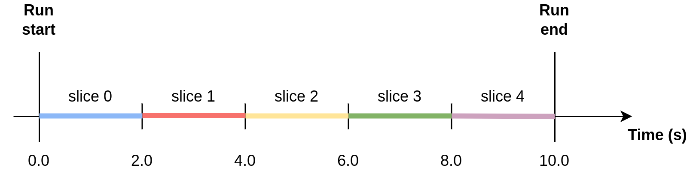
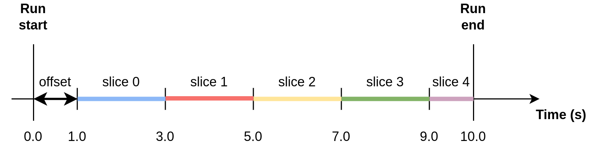
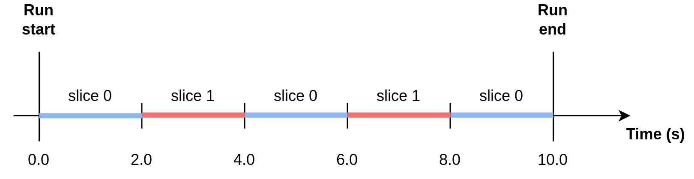
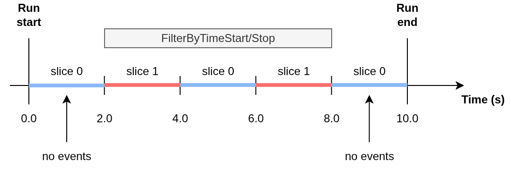
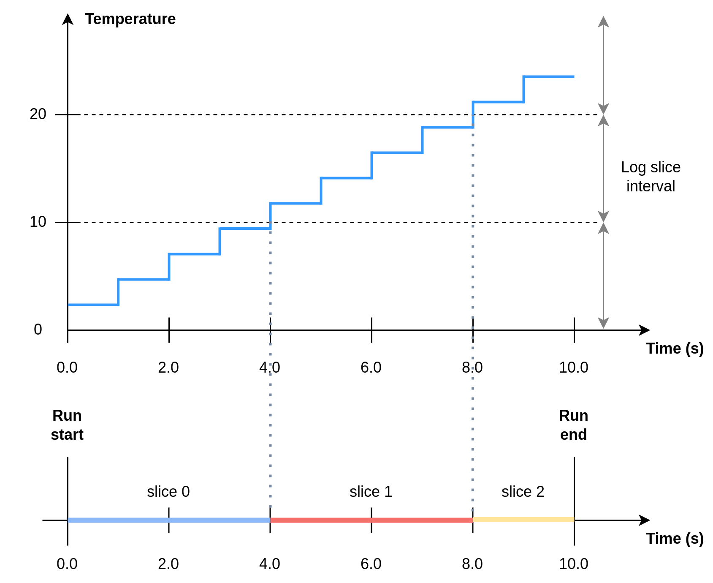
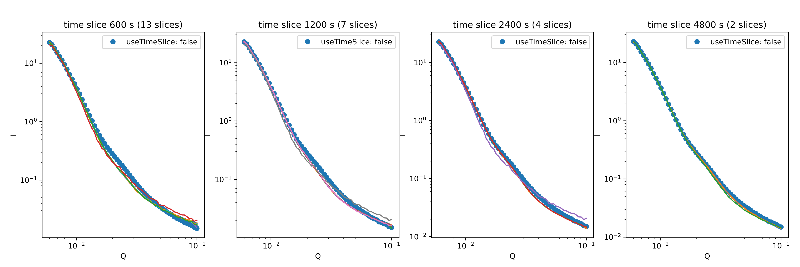
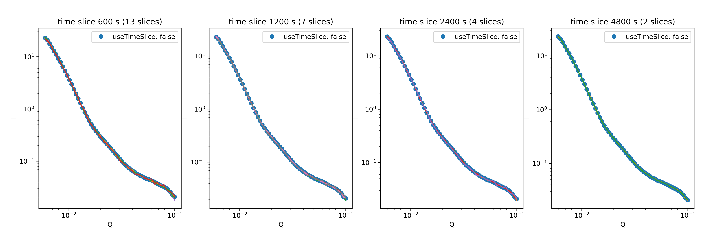

.. _user.slicing:

Slicing
=======

The user can perform slicing of a data set by either time or sample log (but not both). Data
reduction is performed separately on each slice according to the specified reduction parameters.
The output files will have a slice index appended to the configured ``"outputFileName"``, e.g.
``myFileName_0_Iq.dat``, ``myFileName_1_Iq.dat``, etc.

Time Slicing
------------

The user can specify time slicing to slice a run by time intervals and, optionally, a time period.
The following parameters specify the time slicing:

.. code-block:: json

    {
        "useTimeSlice": true,
        "timeSliceInterval": 4800,
        "timeSliceOffset": 0.0,
        "timeSlicePeriod": null,
    }

Example 1: Slicing using time interval
++++++++++++++++++++++++++++++++++++++

.. code-block:: json

    {
        "useTimeSlice": true,
        "timeSliceInterval": 2.0,
        "timeSliceOffset": 0.0,
        "timeSlicePeriod": null,
    }

Example 2: Slicing using time interval and offset
+++++++++++++++++++++++++++++++++++++++++++++++++

.. code-block:: json

    {
        "useTimeSlice": true,
        "timeSliceInterval": 2.0,
        "timeSliceOffset": 1.0,
        "timeSlicePeriod": null,
    }

Example 3: Slicing using time slice period
++++++++++++++++++++++++++++++++++++++++++

When using a time slice period, slices for a given time interval are reduced together.
In the figure, red slices are reduced together, and blue slices are reduced together.

.. code-block:: json

    {
        "useTimeSlice": true,
        "timeSliceInterval": 2.0,
        "timeSliceOffset": 0.0,
        "timeSlicePeriod": 4.0,
    }

Note: if the time slice interval is a non-integer multiple of the period, then the remainder will be the last of the slices. In the example below, there will be two 3 second slices, then one 2 second slice.

.. code-block:: json

    {
        "useTimeSlice": true,
        "timeSliceInterval": 3.0,
        "timeSliceOffset": 0.0,
        "timeSlicePeriod": 8.0,
    }

Example 4: Time slicing and event filtering during loading
++++++++++++++++++++++++++++++++++++++++++++++++++++++++++

The time slicing parameters are applied relative to the whole data, independent of any event
filtering during loading (i.e. using the parameter ``"loadOptions"``).

.. code-block:: json

    {
        "sample": {
            "loadOptions": {"FilterByTimeStart": 2.0, "FilterByTimeStop": 8.0}
        },
        "configuration": {
            "useTimeSlice": true,
            "timeSliceInterval": 2.0,
            "timeSliceOffset": 0.0,
            "timeSlicePeriod": 4.0,
        }
    }

Log Slicing
-----------

Log slicing refers to slicing by the value of a `sample log
<https://docs.mantidproject.org/nightly/tutorials/mantid_basic_course/connecting_data_to_instruments/06_sample_logs.html>`_
in the NeXus file corresponding to the sample run.

.. code-block:: json

    {
        "useLogSlice": true,
        "logSliceName": "MySampleLog",
        "logSliceInterval": 200.0,
    }

Example: Log slicing using log "Temperature"
++++++++++++++++++++++++++++++++++++++++++++

.. code-block:: json

    {
        "useLogSlice": true,
        "logSliceName": "Temperature",
        "logSliceInterval": 10.0,
    }

Slicing and Error-Weighted Binning
----------------------------------

Note that using error-weighted averaging in combination with slicing may result in disparity
between time sliced and non-time sliced data if there is not enough data in the slices for the
error distribution to converge.

.. code-block:: json

    {
        "useErrorWeighting": true,
    }

Figure 1 compares I(Q) for the whole run (blue dot markers) to I(Q) for time slices
of the data (solid lines) for the time slice intervals 600 s, 1200 s, 2400 s and 4800 s. The time
sliced I(Q) converges to the total I(Q) with increasing time slice interval.

   Figure 1: I(Q) for time slices of a run compared to the total run for different time slice intervals and
   with error-weighted averaging (``"useErrorWeighting": true``).

In Figure 2, the same comparison between time sliced and non-time sliced data but with
error-weighted averaging turned off (i.e. using arithmetic averaging) shows no dependence on the
time slice interval.

   Figure 2: I(Q) for time slices of a run compared to the total run for different time slice intervals and
   with error-weighted averaging (``"useErrorWeighting": false``).
